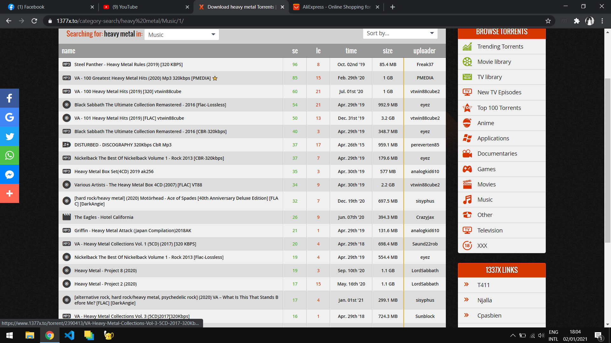

# Prashant Bhandari
## My name is prashant bhnadari.

|Name|Rollno|Class|
|----|---|---|
|Prashant Bhandari|12|11|
|Rakesh Oli|23|12|

# List

* **item 1**
* _item 2_
* item 3

1. item 1
2. item 2
3. item 3

>According to Albert Enstine _"Not ever girl is beautiful"_

[Facebook](www.facebook.com "Open facebook")


`My C Code:`

```C
#include <stdio.h>
#include <conio.h>
void binarysearch(const int *arr,int n,int key)
{
    int l=0,r=n-1,mid,found=0;
    printf("*********[SEARCH RESULT]*********\n");
    while(l<=r)
    {
	mid=l+(r-l)/2;
        if(key==arr[mid])
        {
            printf("Found %d at index %d\n\n",key,mid);
            found++; 
            break;
        }
        else if(key<arr[mid])
        {
            r=mid-1;
        }
        else if(key>arr[mid])
        {
            l=mid+1;
        }
        else
        {
            printf("Error!");
        }
        
    }
    if(found==0)
	{
        printf("Not found\n\n");
    }
}
int main()
{
    int n=5;//Number of element in the array.
    int arr[]={7,5,7,8,78};
    int arr2[]={1000,1234,3333,3335,33533};
    int key=8;//Key to search in the array.
    binarysearch(arr,n,key);
    binarysearch(arr,n,78);
    binarysearch(arr,n,7);
    binarysearch(arr,n,1);
    binarysearch(arr,n,2);
    binarysearch(arr2,5,3333);
    binarysearch(arr2,5,1234);
    binarysearch(arr2,5,33533);
    getch();
    return 0;
}

```
